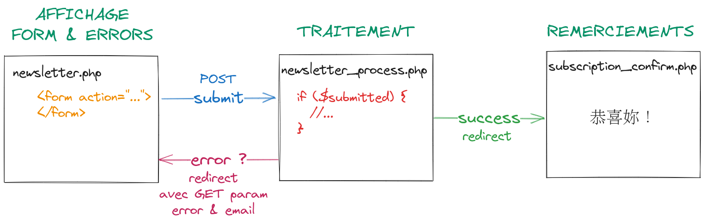

# Human Booster - PE7 - PHP

## Introduction

[intro](intro/index.php) :

- `index.php` : page d'accueil
- Fonction de la SPL `echo` pour ajouter du contenu à la réponse
- HTML & PHP au sein d'un même fichier (balises PHP)
- Variables, constantes
- Commentaires
- Concaténation (opérateur `.`)

[index.php](index.php) :

- Fichier racine du serveur web au sein du dev container VSCode
- Fonction de la SPL `phpinfo()` pour afficher les informations de configuration de PHP dans le navigateur (CLI : `php -i`)

## Tableaux

[arrays](arrays/index.php) :

- Initialisation d'un tableau (vide ou avec des éléments)
- Accès à un élément seul (index/clé)
- Ajout d'un élément au début du tableau (`array_unshift`), à la fin du tableau (`$tab[] = "element"`)
- Fonction de la SPL `count` pour compter les éléments d'un tableau
- Tableaux associatifs : définition de clés/index personnalisés, association à une valeur avec `=>`
- Array destructuring : extraction de valeurs contenues dans un tableau, directement dans des variables
- Spread operator : pour propager les éléments d'un tableau au sein d'un autre tableau (utile pour une copie par exemple)
- Fonctions sur les tableaux : utilisation de quelques fonctions de la SPL, différence entre style impératif & déclaratif

[boucles](arrays/loops.php) :

- Exploration des 4 types de boucles en PHP :
  - `while`
  - `for`
  - `do...while`
  - `foreach` : avec foreach, 2 syntaxes :
    - `foreach ($tab as $value)`
    - `foreach ($tab as $key => $value)`

[Atelier tableau de produits multidimensionnel](arrays/multidimensional.php) :

- Définition d'un tableau multidimensionnel : un tableau de tableaux
- Les sous-tableaux représentent chaque produit, et sont indexés sur les propriétés d'un produit
- Utilisation de TailwindCSS en mode CDN (déconseillé sur des vrais projets, utiliser NPM + un bundler comme [Webpack](https://webpack.js.org/), [Parcel](https://parceljs.org/), [Rollup](https://rollupjs.org/) par exemple)
- Avec une boucle `foreach`, on itère sur chaque élément du tableau : chaque produit. Chaque produit étant lui-même un tableau associatif, on peut accéder à ses propriétés via les index/clés correspondant(e)s

## Inclusion de fichiers

Reprise de l'atelier liste de produits, et séparation dans [un fichier de data](file-inclusion/data/products.php) : séparation des responsabilités, le fichier de data définit la donnée, la page d'index affiche la donnée. On peut alors importer (`require_once`) le fichier de data dans l'index pour en afficher le contenu.

Ensuite, création de [composants](file-inclusion/components/) pour séparer l'affichage en différentes parties.

Ajout d'une [navbar](file-inclusion/components/nav.php) que l'on inclut directement dans le [head](file-inclusion/components/head.php) de l'application.

Enfin, [découverte de la constante `__DIR__`](https://github.com/ld-web/hb-php-pe7-2023/commit/979191b459afc517fef30027654386b933f149cc#diff-4a5469266895af726b0632525db30d22eb12e3752d278e9588d241a376106bfbR25) pour désigner le répertoire courant. Cela nous aide à construire des chemins plus robustes, et qui ne dépendent pas du script en cours d'exécution.

## Superglobales

Découverte de la variable superglobale [`$_GET`](https://github.com/ld-web/hb-php-pe7-2023/commit/10d9e3e7360a113f6d2f06beca6d7b10683da2ee#diff-726a4e253257ed88e966a23e57153924cf3a42e3e9b17ded7742ed0301826b76R6) pour récupérer les paramètres inscrits dans l'URL.

## Fonctions

Écriture de plusieurs fonctions :

- [minInt](functions/minInt.php) : Plus petit nombre parmi 3
- [factorial](functions/factorial.php) : Factorielle d'un nombre
- [getIntPart](functions/getIntPart.php) : Récupérer la partie entière d'un nombre passé en paramètre
- [getDigitsSum](functions/getDigitsSum.php) : Calculer la somme des chiffres composant un nombre. Dans cette fonction, on réutilise la méthode `getIntPart` définie préalablement. On peut alors `require_once` le fichier qui contient sa définition, afin de pouvoir l'utiliser dans `getDigitsSum`
- [apply_html](functions/apply_html.php) : Application d'une balise HTML sur un texte donné. Définition de constantes afin de définir des codes (valeurs entières) et leur donner une signification dans le code source. On peut alors manipuler des constantes comme `BOLD` ou `ITALIC` sans avoir à retenir la valeur entière associée
- [fillArray](function_fillArray/) : Définition d'une fonction dans un fichier séparé [functions.php](function_fillArray/functions.php), puis `require_once` dans [l'index](function_fillArray/index.php). Petite combinaison avec le chapitre sur les superglobales : on passe en paramètre GET le nombre d'éléments qu'on souhaite puis on génère dynamiquement un tableau en fonction de ce paramètre GET
- [Fonctions anonymes, arrow function](functions/anonymous_arrow_fn.php)
- [Argument unpacking](functions/argument_unpacking.php)

## Atelier MyCorp

L'atelier MyCorp démarre de la façon suivante :

Vous allez démarrer un nouveau projet présentant votre entreprise :

- Créez une page d'accueil présentant les membres de votre entreprise
- La page d'accueil sera une liste des membres, chargée depuis un tableau PHP
- Pour un membre, on retrouvera les informations suivantes :
  - name
  - firstname
  - birthDate (format string "JJ/MM/AAAA")
  - abilities : tableau de compétences, par exemple "dev", "backend", "frontend", "dba", "devops", "sysadmin", etc...s'il s'agit d'une entreprise de dev
  - quote : une citation préférée, format string
  - picture : une URL vers une image de portrait (sur le web, chemin absolu)

Chaque membre sur la page d'accueil sera cliquable pour accéder à une seconde page "member.php" affichant un membre de l'entreprise en particulier.

Sur la page de membre, reprenez la solution avec foreach utilisée lors de l'atelier sur les produits. Chercher ensuite comment réécrire cette fonctionnalité de manière fonctionnelle (avec des fonctions de la SPL)

[Atelier MyCorp](atelier_mycorp/) :

- Définition des données : deux fichiers [abilities](atelier_mycorp/data/abilities.php) et [members](atelier_mycorp/data/members.php), avec inclusion d'une propriété `id` pour simuler une clé primaire. Nous pouvons alors référencer des compétences depuis le tableau de membres (le tableau `abilities` dans chaque membre ne contient que des valeurs entières, références des ID du tableau `abilities`)
- Sur [l'index](atelier_mycorp/index.php), boucle sur les `$members` issus des datas, et définition d'un template que l'on `require` autant de fois qu'on a de membres dans le tableau
- Définition d'une fonction [`getFullName`](atelier_mycorp/functions.php), utilisée à la fois dans la liste sur [l'index], mais également sur la [page de membre](atelier_mycorp/member.php). L'intérêt est ici de montrer les possibilités d'évolution : on ajoute un paramètre pour l'ordre d'affichage (soit le nom en premier, soit le prénom en premier). On réutilise alors des constantes pour définir des codes qui pilotent l'ordre d'affichage
- Au niveau du layout, définition d'un header, d'une nav et d'un footer
- Ajout de couleurs aux compétences afin d'afficher des petits badges avec des couleurs d'arrière-plan différentes
- Création d'une méthode [`findAbility`](atelier_mycorp/functions.php) pour trouver une compétence à partir de son ID

## Formulaires

[Fausse authentification](forms/) : Introduction aux formulaires avec un formulaire d'authentification (non fonctionnel) en méthode POST

## Suite atelier MyCorp, formulaire newsletter

Dans l'atelier MyCorp, création d'un formulaire de newsletter. Énoncé :

- Ajouter un formulaire d'inscription à la newsletter
- Ce formulaire peut se trouver sur une page à part entière ou bien dans le layout
- L'idée sera donc que n'importe quel utilisateur peut s'inscrire en renseignant son email
- L'email reçu par la cible du formulaire devra donc être enregistré dans un fichier texte
- Ce fichier texte se trouvera sur le serveur, à la racine du projet
- Dans la cible du formulaire, on s'assurera que l'email est au bon format, et qu'il n'est pas déjà enregistré dans le fichier texte
- Ajouter une vérification supplémentaire : que le domaine de l'email ne fasse pas partie d'un ensemble (tableau) de domaines considérés comme des spams

Création de la page [newsletter.php](https://github.com/ld-web/hb-php-pe7-2023/blob/newsletter-00/atelier_mycorp/newsletter.php) présentant un formulaire d'inscription à la newsletter, et intégrant le traitement complet de ce formulaire. À ce stade, nous n'ajoutons pas de cible au formulaire pour que le même fichier se charge de l'affichage et du traitement du formulaire. Sur la branche `newsletter-00`.

Pour la validation, découverte des fonctions de la SPL disponibles :

- `empty` pour vérifier si une variable est vide
- `filter_var` pour vérifier le format d'un email

Pour les interactions avec un fichier, découverte des fonctions de la SPL :

- `file` pour lire un fichier et charger son contenu dans un tableau
- `fopen`, `fwrite`, `fclose` pour ouvrir un fichier, écrire dedans puis le refermer
- Pour isoler le domaine d'un email, afin de vérifier s'il s'agit d'un spam, utilisation des fonctions `strstr` et `ltrim`

## Atelier MyCorp : décomposition

Dans la branche [newsletter-01](https://github.com/ld-web/hb-php-pe7-2023/tree/newsletter-01), fusionnée ensuite dans la branche main.

- Déplacer la cible du formulaire dans un autre fichier
- Trouver un moyen de passer les messages d'erreur d'un fichier à un autre. En l'occurence, si une erreur survient, comment revenir au fichier `newsletter.php` en lui transmettant la raison pour laquelle on revient
- Réfléchir à un moyen de séparer notre code dans différents fichiers : ces fichiers seront probablement à `require_once` par exemple. Également, pourrait-on créer des fonctions qui nous serviraient à valider notre email ?

On déplace la cible du formulaire dans un fichier [newsletter_process.php](atelier_mycorp/newsletter_process.php). Ce fichier devient alors responsable du traitement des données du formulaire.

En cas d'erreur durant le traitement, on redirige vers la page du formulaire, [newsletter.php](atelier_mycorp/newsletter.php), avec un paramètre `GET` décrivant l'erreur et un paramètre `GET` pour l'email qui a été renseigné.

Définition de fonctions & constantes dans un fichier [functions/newsletter.php](atelier_mycorp/functions/newsletter.php). Les constantes servent à définir les différents types d'erreurs qu'on peut rencontrer. On peut ensuite leur associer un message d'erreur avec une fonction `getErrorMessage`.

Dans le même fichier, on continue notre décomposition avec 2 fonctions supplémentaires : `registerEmail` et `getTotalEmails`, chargées respectivement d'enregistrer un nouvel email au sein du fichier, et de compter le nombre d'emails présents dans le fichier.

## MyCorp : recherche de membres

Réalisation d'un moteur de recherche de membres (par nom et prénom, donc nom complet).

> Objectifs : formulaires, paramètres GET, création de fonctions, fonction anonyme, utilisation de fonctions de la SPL

Création d'une [fonction de recherche](atelier_mycorp/functions/member.php) de membre, en utilisant des fonctions de la SPL.

Dans le fichier [search.php](atelier_mycorp/search.php), extraction du paramètre GET de recherche issu du [formulaire](atelier_mycorp/layout/searchbar.php).

Ensuite, ajout d'un filtre sur les compétences : dans la searchbar, ajout d'une liste déroulante `select` présentant l'ensemble des objets `Ability` enregistrés dans les données.

Ajout d'un paramètre facultatif `$abilityId` à la fonction `findMembers` pour pouvoir chercher un membre par nom et par compétence.

## Programmation orientée objet

[Introduction](https://github.com/ld-web/hb-php-pe7-2023/commit/9cbea1b26ca00503d8f7b074802766cfc840b8cf) :

- Création d'une classe simple `Product` : propriétés, méthodes, visibilité & encapsulation

Ajout d'une classe `User`

- Dans index.php, création d'instances de classes : après la définition de classes, on crée des objets de ces classes

### Constructeur

Ajout d'un constructeur dans les classes `Product` et `User`, pour initialiser des propriétés dès la construction de l'objet.

## Atelier Cars

### Démarrage, éléments de menu dynamiques

Création d'une classe [`MenuItem`](poo-cars/classes/MenuItem.php)

- 3 propriétés : `url`, `label` et `active`
- À la construction, on ne passe en paramètre que l'url et le libellé
- On déduit alors dynamiquement la valeur de `active` en regardant la page courante (superglobale `$_SERVER`)
- On crée une méthode `getCssClasses` renvoyant des classes Tailwind CSS suivant l'état de l'élément (actif ou inactif)
- Dans le layout ([`nav.php`](poo-cars/layout/nav.php)), on crée des instances de `MenuItem`, qu'on place dans un tableau
- On boucle sur ces éléments pour les afficher un par un
- On n'a pas à se préoccuper de leur apparence : l'appel à `getCssClasses` permet d'appliquer automatiquement un effet actif/inactif suivant la page où on se trouve

## Membres statiques

[Commit concerné](https://github.com/ld-web/hb-php-pe7-2023/commit/eef00d15132e1d0c144fdcdc44e1fb70730ba506)

> Le plus important à retenir, c'est que les membres statiques ne sont pas reliés à une **instance** de classe mais à **la classe** elle-même

Une constante de classe est statique par défaut, pas besoin d'ajouter le mot-clé `static` devant.
